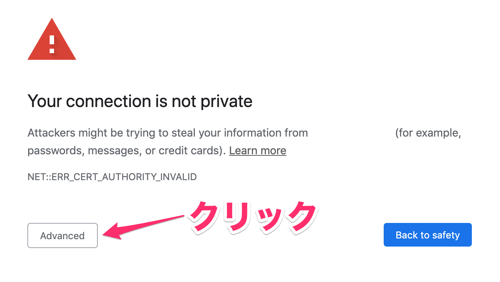
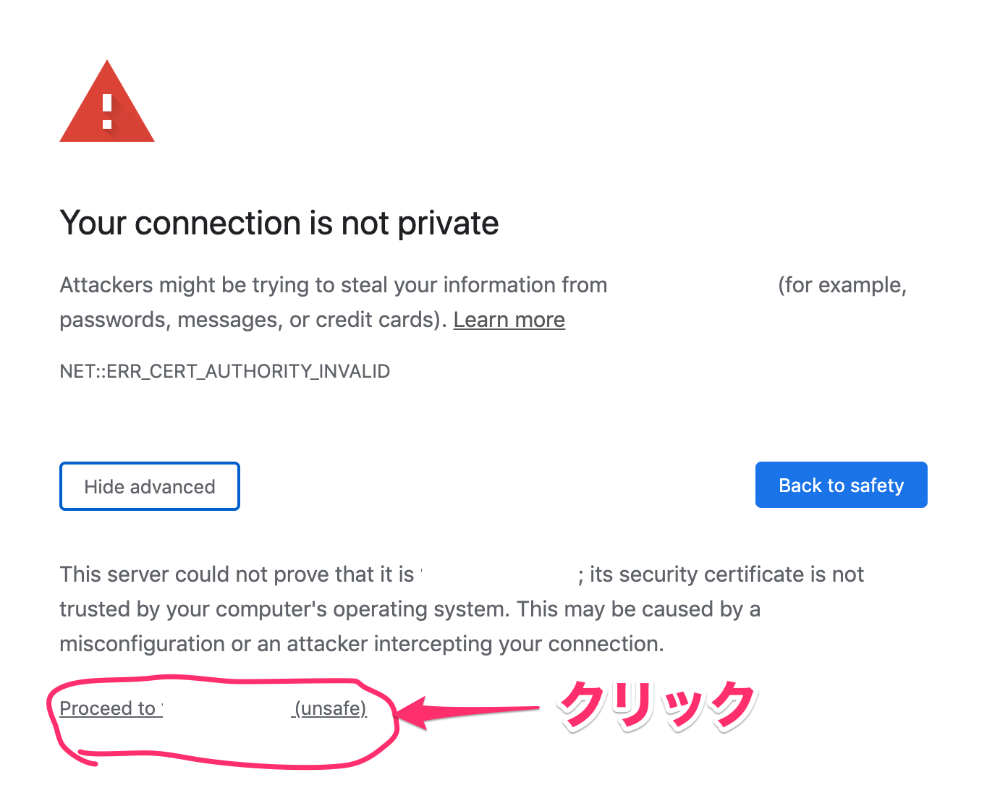
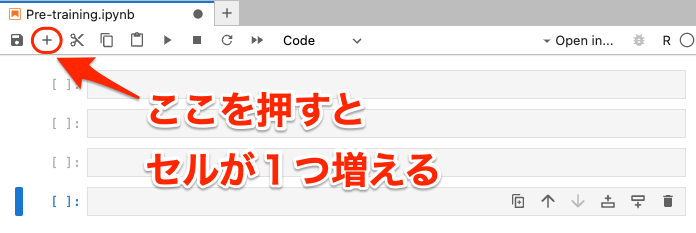
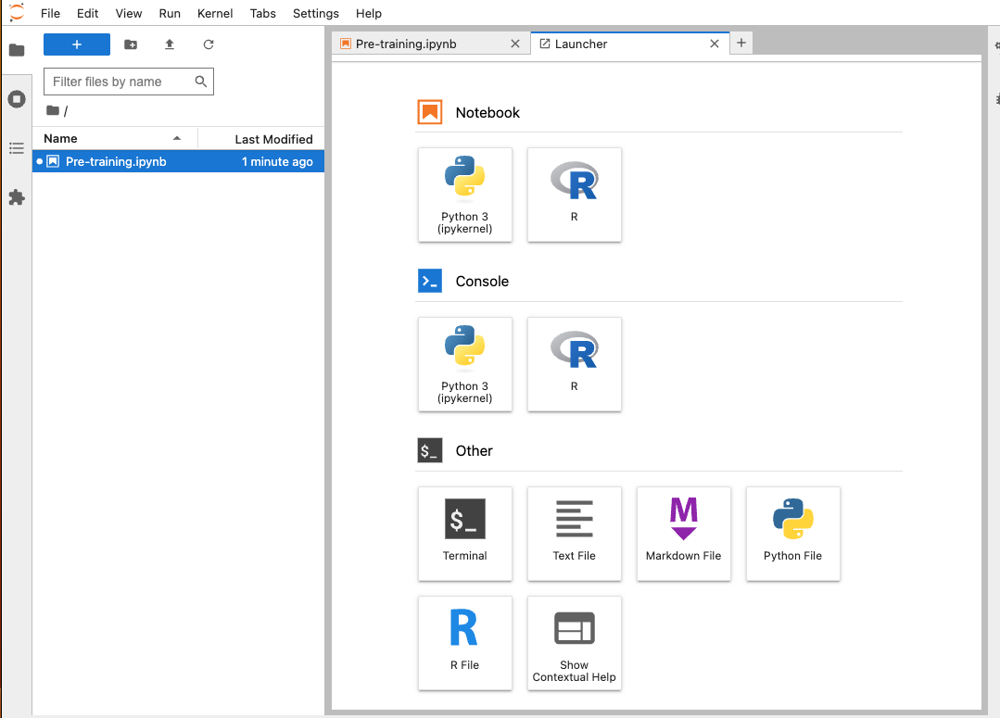

# 演習A：手順

## A00: 自分のユーザ名とパスワードを確認する

> - **ユーザ名とパスワードはmanabaに記載してあります**  
>   - [manabaのページ](https://manaba.tsukuba.ac.jp/ct/course_2438996)のコンテンツの「２日目資料」のExcelファイルを確認してください。

## A01: JupyterHub へアクセスする

> - **URLはmanabaに記載してあります**  
>   - [manabaのページ](https://manaba.tsukuba.ac.jp/ct/course_2438996)のコンテンツの「２日目資料」のExcelファイルを確認してください。

アクセスして下図のような画面が表示された場合、`ADVANCED`をクリックしてください（下図、矢印）。

- 

さらに、`Proceed to [IPアドレス] (unsafe)` をクリックします。

- 

すると、下図のようなログイン画面がでてきます。事前に配布したユーザ名とパスワードを入力して `Sign in` をクリックします。

- 

下図の画面が出たらログイン成功です。

- 

## A02: R のノートブックを開く

"Notebook" の中の "R" を選択します。

- 

新しいタブが開き、下図のように右上に "R"と書かれていたら成功です。

- 

## A03: [Jupyter基本動作] ノートブックの名前を変更する

以下の要領で、ファイル名を "Pre-training.ipynb" と変更しましょう。

- 
- 
- 
- 
- 

## A04: [Jupyter基本動作] セルについて

四角で囲まれた場所をセルと呼びます。

セルにはコードを書き込むことができます。

- 

## A05: [Jupyter基本動作] セルを増やす

"+"のボタンを押した分だけセルが増えます。

- 

## A06: [Jupyter基本動作] 実行してみる

1. いずれかのセル（どれでもいい）に `1+1` と書き込んでみましょう
2. ▶（再生ボタン）を押すと、選択しているセルのコードが実行されます。
3. セルのすぐ下に、実行結果が出力されます。

- 

   1. 今の場合だと `2` と表示されるはず

## A07: ターミナルでコマンドを実行する

1. 画面左上もしくは右側の「+」ボタンを押します
   - 
2. すると「ランチャー（Laucher）」が開きます
   - 
3. 「Terminal」のアイコンをクリックします
    - 
4. すると新しいタブでターミナル（白い画面、黒い画面のときもある）が表示されます。
   - 
5. `ls` を実行すると、 `Pre-training.ipynb` が出力されるはずです。
   - 「`ls` を実行する」とは「半角で `ls` と入力し、Enter (Return) キーを押す」という意味です
   - 

## A08: Jupyter Hub からノートブックをHTML形式に変換してダウンロードする

以下の要領で、Jupyter Hub から  `Pre-train.ipynb` を HTML形式に変換してダウンロードしましょう。

1. Notebook (.ipynbのファイル) を開いた状態で
2. 上のメニューで `File > Save and Export Notebook As... > HTML` を選択する
   - 
3. 自分のパソコンに `Pre-train.html` という名前のファイルが保存されていることを確認する
   - 拡張子は `.ipynb` でなく `.html` である
