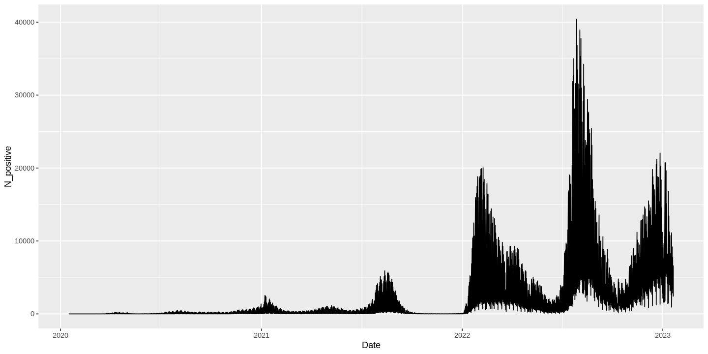
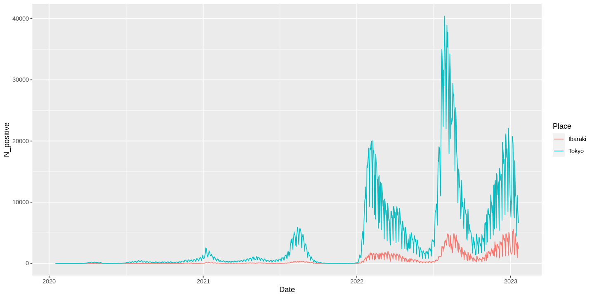
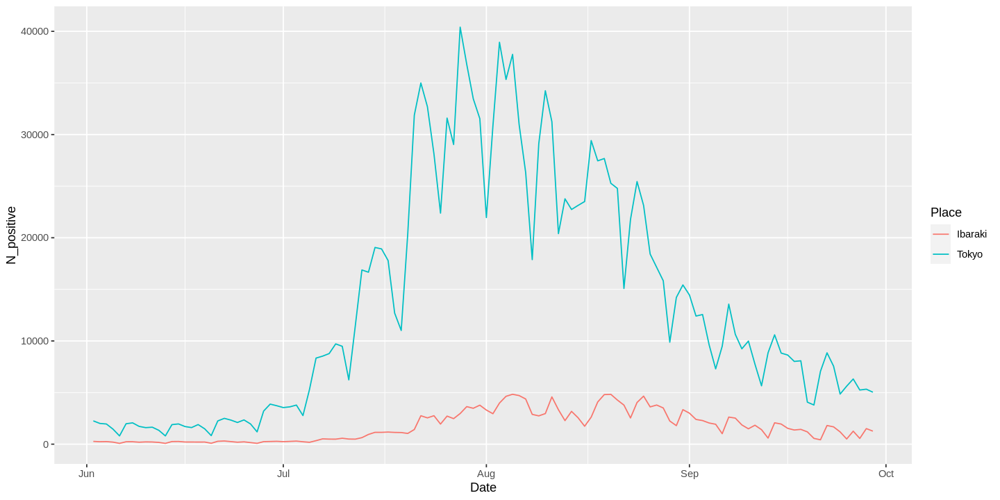
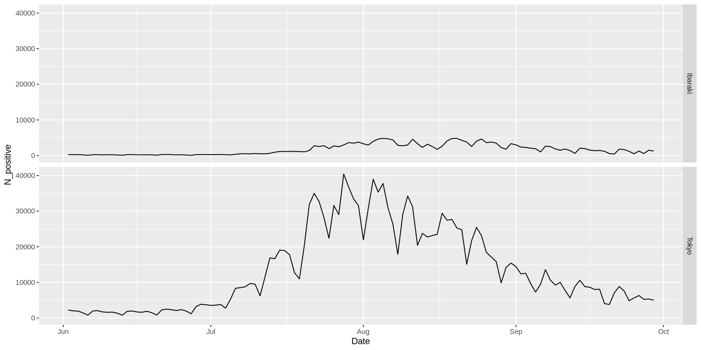
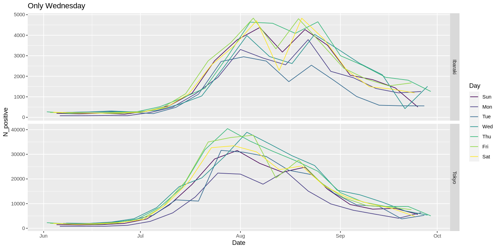
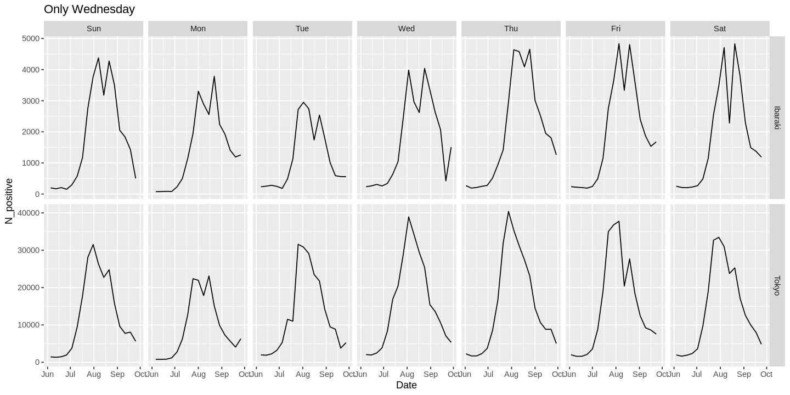

# 演習B：手順1

## 概要

- 演習Aに引き続き、 `newly_confirmed_cases_daily_20230121.csv` を分析します。
- 方法
  - まず、Jupyter Hub で新たに R のノートブックを作成し、`B_01` との名前をつけましょう
  - 次に、以下の、Rのコードを、コピーし、実行しましょう。

## 必要なパッケージ（拡張機能）の読み込み

- `library()` 関数を使う
- `tidyverse` はデータフレーム系の処理が便利なパッケージ


```R
library(tidyverse)
```

- `lubridate` は日付のデータを扱うのに便利なパッケージ。

```R
library(lubridate)
```


## ファイルの読み込み

- `read_csv()` コマンドを使う
    - `col_names=TRUE` はファイルの１行目がヘッダー行（列名が書いてある）であるという指定
- `df1` という名前のオブジェクトに読み込んだデータをデータフレーム（表）として代入


```R
df1 <- read_csv("data/newly_confirmed_cases_daily_20230121.csv", col_names=TRUE)
```


## 読み込んだファイルの中身の確認

- `head()` 関数は、オブジェクトの最初の数行を出力に表示してくれる
- ファイルを読み込んだ後はこのように中身を確認することで、意図通りのデータ構造になっているか、文字化けがないかなどを確認できる


```R
head(df1)
```


## 列のデータ型（クラス）の変更

- 直上で `Date` という列の下に `<chr>` と書いてある。これはこの列が「文字列（character)」というデータ型になっていることを示している。
- `mutate()` コマンドは列を追加したり、別の列に入れ替えたりできる。
    - ここでは、 `Date` 列の内容を `as_date()` という関数で「Date（日付）」型に変換した上で `Date` 列を書き換えている
    - → 結果として、再び `head()` コマンドで中身を確認した際には `Date`列のところに `<date>` と表記される（先ほどは `<chr>` だった）。これにより、 「Date（日付）」型に変換されたことが確認できる。
    
    
### パイプ記号 (`|>`) について

- Rでのデータ解析では複数の関数を順繰りに適用していくことが多い。
    - つまり、ある関数の出力を別の関数の入力にすることを繰り返す。
- この際、関数を入れ子にした書き方だと読みづらい
    - 例えば、 `f()`, `g()`, `h()` という関数を `x` というオブジェクトにかけるとすると、 `h(g(f(x)))`
- そこでパイプ記号 (`|>`)を用いることで読みやすくする（可読性を高める）。
    - パイプ記号の左側が入力で、右側が出力になっている。
    - 上の例では、`f(x) |> g() |> h()` といった書き方ができる
- オブジェクト自体をパイプ記号 (`|>`)の左側に置くこともできる
    - 上の例では、 `x |> f() |> g() |> h()` といった書き方ができる
- パイプでつながった部分はひとまとまりと（Rに）解釈される
    - 上の例では、最終的な出力を `result` に代入したい場合、 `result <- x |> f() |> g() |> h()`と書いても、 `result <- h(g(f(x)))` と書いても同じと解釈される。
- パイプの後ろ（右側）に改行を入れても、改行が入っていないのと同じように解釈される
- 下では、
    - `df1` を `mutate()`関数の入力にしているので、 `mutate(df1, Date = as_date(Date))` という書き方もできる
    - 下では代入操作について、 `df1 <- mutate(df1, Date = as_date(Date))` という書き方もできる


```R
df1 <- df1 |>
    mutate(Date = as_date(Date))
```


```R
head(df1)
```

## tidyなデータへの変換：横長のデータから縦長のデータへ

- 「tidyなデータ」（タイディーと読む）にしたい
- 「tidyなデータ」とは、簡単に説明すると、「同じ種類の数値」が１つの列に収まっていること
    - tidyなデータは人間には読みづらいことが多いが、計算機にとっては読みやすい
    - [より詳しい説明はこちらをどうぞ](https://id.fnshr.info/2017/01/09/tidy-data-intro/)
- 具体例で説明すると、上の `df1` は **tidyではない**と言える。
    - なぜなら、 `Hokkaido`, ... などは「新規陽性者数」という同じ種類の数値データを扱っていると言える
- tidy であるならどうなっていればいいか
  - 各行：１つのデータのレコードを表す
  - 各列：１つのデータのレコードに対する、異なる属性を表す
    - この例だと、
      - 日付
      - 都道府県
      - 新規陽性者数
    - が並んだデータになっていればいい 
- tidyでないデータをtidyにするのは、俗に「横長」のデータを「縦長」のデータへ変換するという
  - これを担うのが `pivot_longer()` 関数である

### `pivot_longer()` 関数

- 第１引数：縦長にしたい列がどこかを指定する
  - 下の例だと、 `c()` という要素を連結して１つの配列にする関数で `Tokyo`列と`Ibaraki`列を繋いで設定している
- `names_to`: 第１引数で指定した列の名前の情報を格納する新たなの名前
  - 下の例だと `Place｀と設定している。
- `values_to`: 第１引数で指定した列の値を格納する新たな列の名前
  - 下の例だと `N_positive｀と設定している。
    
### `select()` 関数

- `select()` 関数はデータフレームから特定の列だけを抽出する
    - 下では、`Date`, `Tokyo`, `Ibaraki` という３つの列を抽出している
    - `pivot_longer()` を使うときに、 `select()` を使わないといけないわけではなく、単に今回は後で `Tokyo` と `Ibaraki` のデータのみを使うからそうしているだけ。


```R
df1long <- df1 |>
    select(Date, Tokyo, Ibaraki) |>
    pivot_longer(c(Tokyo, Ibaraki), names_to = "Place", values_to = "N_positive")

head(df1long)
```

- こんな感じの出力がされる 
  - ↓こっちの方が元のデータより tidy であると考える


<table class="dataframe">
<caption>A tibble: 6 × 3</caption>
<thead>
	<tr><th scope=col>Date</th><th scope=col>Place</th><th scope=col>N_positive</th></tr>
	<tr><th scope=col>&lt;date&gt;</th><th scope=col>&lt;chr&gt;</th><th scope=col>&lt;dbl&gt;</th></tr>
</thead>
<tbody>
	<tr><td>2020-01-16</td><td>Tokyo  </td><td>0</td></tr>
	<tr><td>2020-01-16</td><td>Ibaraki</td><td>0</td></tr>
	<tr><td>2020-01-17</td><td>Tokyo  </td><td>0</td></tr>
	<tr><td>2020-01-17</td><td>Ibaraki</td><td>0</td></tr>
	<tr><td>2020-01-18</td><td>Tokyo  </td><td>0</td></tr>
	<tr><td>2020-01-18</td><td>Ibaraki</td><td>0</td></tr>
</tbody>
</table>


## 列の追加：曜日を追加

- `mutate()` は列の追加ができる（前述）
- `wday()` は第1引数に設定された日付を曜日に変換できる


```R
df1long <- df1long |>
    mutate(Day = wday(Date, label = TRUE, abbr = TRUE))

head(df1long)
```

- 下のような出力がされるはず
  - `head()` で `Day` という列が追加されたこと、その内容が曜日（の英語３文字表記）であることを確認


<table class="dataframe">
<caption>A tibble: 6 × 4</caption>
<thead>
	<tr><th scope=col>Date</th><th scope=col>Place</th><th scope=col>N_positive</th><th scope=col>Day</th></tr>
	<tr><th scope=col>&lt;date&gt;</th><th scope=col>&lt;chr&gt;</th><th scope=col>&lt;dbl&gt;</th><th scope=col>&lt;ord&gt;</th></tr>
</thead>
<tbody>
	<tr><td>2020-01-16</td><td>Tokyo  </td><td>0</td><td>Thu</td></tr>
	<tr><td>2020-01-16</td><td>Ibaraki</td><td>0</td><td>Thu</td></tr>
	<tr><td>2020-01-17</td><td>Tokyo  </td><td>0</td><td>Fri</td></tr>
	<tr><td>2020-01-17</td><td>Ibaraki</td><td>0</td><td>Fri</td></tr>
	<tr><td>2020-01-18</td><td>Tokyo  </td><td>0</td><td>Sat</td></tr>
	<tr><td>2020-01-18</td><td>Ibaraki</td><td>0</td><td>Sat</td></tr>
</tbody>
</table>


## 図のプロット：準備

- Jupyter notebook 特有で必要になるコマンド。図がプロットされる領域のサイズを変更するのに使用する。


```R
options(repr.plot.width=12, repr.plot.height=6)
```

## 図のプロット：普通の折れ線グラフ

- x軸に日付、y軸に茨城県の新規感染者数の数 (`Ibaraki`）の列の数値を設定した折れ線グラフを作りたい


`ggplot()` コマンドを使用する
- 第１引数にデータフレームを設定する。
    - ここでは、 先ほど読み込んだりした `df1` を設定している
- 第２引数に `aes()` によって「データフレームの各列をどのように使いたいか」を指定する
    - ここでは、x軸に日付 (`Date`)、y軸に茨城県の新規感染者数の数 (`Ibaraki`）の列の数値を設定
- `ggplot()` コマンドは単独で使われることはなく、「どんな形のグラフを書きたいか（geometry）」を表す `geom_` で始まる関数を一緒に使う。
    - ここでは、折れ線グラフを表す `geom_line()` を使用する
- ggplot() コマンド とそのほかのコマンドは `+` (プラス記号) でつなげることで、順次組み合わせて適用することを表す

`ggplot()` コマンド の出力
- ここでは、ggplot() コマンド の出力を `g1` というオブジェクトに代入している
- その上で、 `plot(g1)` で、 `g1`に代入されたプロットの内容を描画（plot）している

### よくない例

- これだと、 `Tokyo` と `Ibaraki` のデータが混ざっている


```R
g1 <- ggplot(df1long, aes(x=Date, y=N_positive)) + geom_line()

plot(g1)
```

- 下のような出力がされることを確認する
    

    


### `Place` の値によってデータを分けて折れ線グラフをプロットする

- `Place` 列が `Tokyo` と `Ibaraki` のデータを **分けて** 折れ線グラフにしたい
- １つの方法は `ggplot()` 関数の中の `aes()` に、 `color=Place` をつけること
    - これにより、 `Place`列の値によってデータを分けて色の異なる折れ線で表示できるようになる 


```R
g2 <- ggplot(df1long, aes(Date, N_positive, color=Place)) + geom_line()

plot(g2)
```


    

    


## データフレームのうち、特定の条件に当てはまる行を抽出する

### `filter()` について

-  `filter()` によって特定の条件に当てはまる行を抽出することができます
- 条件は複数設定できます
    - その際、２つの条件を `&` で結ぶと「かつ」(and)という意味で、２つの条件の**全てに**合致する行だけ抽出できます
    - その際、２つの条件を `|` で結ぶと「または」（or）という意味で、２つの条件の**いずれかに**合致する行だけ抽出できます
- 下では２つの条件を `&` で結んでいます
    - １つ目の条件は `Date > "2022-06-01"` です
    - ２つ目の条件は `Date < "2022-09-30"` です


### `dim()` について

- `dim()` はデータフレームや行列の行数や列数を出力する関数です
- 例えば下では、２つの数字を返しています。
    - １つ目が行数、２つ目が列数です

### `print()` について

- `print()` はオブジェクトの中身や出力結果を出力（print）する関数です

### 下のコードについて

- `Date` が　"2022-06-01"より大きく、 "2022-09-30"より小さい行だけを抽出します
- 元のデータフレーム `df1` からこの条件に合致する行だけのデータフレームを `df1long_sub` に保存しています
- `dim(df1long_sub)` の出力から 240 行になっていることを確認
- `dim(df1long)` で元のデータフレーは 2202行であることを確認

```R
df1long_sub <- df1long |> 
    filter(Date > "2022-06-01" & Date < "2022-09-30")

print(dim(df1long_sub))
```

```R
print(dim(df1long))
```

### データフレームを差し替えてプロット

- 上のコード例では全て `ggplot()` 関数の第１引数が `df1` であった
- 下では `ggplot()` 関数の第１引数が `df1`から `df1long_sub` に差し替える
    - `df1long_sub` は"2022-06-01"より大きく、 "2022-09-30"より小さい行だけを抽出したものである
    - なので、以下のグラフはこの特定の範囲についてのプロットになる


```R
g3 <- ggplot(df1long_sub, aes(Date, N_positive, color=Place)) + geom_line()

plot(g3)
```


    

    


## データを特定の列の属性で分けてプロット

### `facet_grid()` について

- `facet_grid()` 関数を使うと、 `ggplot()` での描画をスムーズにできる
- `facet_grid()`関数の第１引数において、 `~` の前と後ろに別々の列名を設定すると、２つの列の値に応じてデータを分けてプロットできる
    - `~` の前は、プロットを並べたときの行方向（縦方向、row）を表す
    - `~` の後ろは、プロットを並べたときの列方向（横方向、column）を表す
- また、 `~` のどちらかに列名を指定したくない場合は、`.` ピリオドを指定する
- 下では、行方向に `Place`を指定し、列方向に `.` をしている
    - 行方向（縦）では、 `Place` の値にが異なるデータを分けて表現する
    - 列方向（横）では特に何も分けない


```R
g4 <- ggplot(df1long_sub, aes(Date, N_positive)) + geom_line() +
            facet_grid(Place~.)

plot(g4)
```


    

    


### `facet_grid()` の `scales = "free_y"` オプション

- `facet_grid()` の `scales = "free_y"` オプションを使うと、y軸の範囲をプロットごとに変えて表示できる


```R
df1long_sub <- df1long |> filter(Date > "2022-06-01" & Date < "2022-09-30")

g5 <- ggplot(df1long_sub, aes(Date, N_positive)) + geom_line() +
            facet_grid(Place~., scales = "free_y")

plot(g5)
```


    

    


### `color=Day` と指定することで、曜日によってデータを変えられる

- `ggplot()` の中の `aes()` の中で  `color=Day`と追加することで、曜日ごとのデータを折れ線グラフの色を変えた形で表示する


```R
g7 <- ggplot(df1long_sub, aes(Date, N_positive, color=Day)) + geom_line() + 
            facet_grid(Place~., scales = "free_y") +
            labs(title = "Only Wednesday")


plot(g7)
```


    

    


### `facet_grid()` の行方向 (row) と列方向 (column) で２種類の列を指定する

- `facet_grid()`関数の第１引数において、 `~` の前と後ろに別々の列名を設定すると、２つの列の値に応じてデータを分けてプロットできる
    - `~` の前は、プロットを並べたときの行方向（縦方向、row）を表す
    - `~` の後ろは、プロットを並べたときの列方向（横方向、column）を表す
- 下では、行方向に `Place`、列方向に `Day` を並べ、それぞれの列の値の「組み合わせ」
    - 例えば、`Place` が `Ibaraki` であり、 `Day`が `Sun` であるデータのみでの折れ線グラフを表す


```R
df1long_sub3 <- df1long |> filter(Date > "2022-06-01" & Date < "2022-09-30")

g8 <- ggplot(df1long_sub3, aes(Date, N_positive)) + geom_line() + 
            facet_grid(Place~Day, scales = "free_y") +
            labs(title = "Only Wednesday")

plot(g8)
```


    

    


## おさらい

### 学んだ関数

**演算子系**

- `<-`: 代入演算子
- `|>`: パイプ演算子（パイプ記号)。関数の出力を次の関数の入力に設定する。コードの可読性を高かめる。

**パッケージ（拡張機能）系**

- `library()`: パッケージ（拡張機能）を読み込む

**一般的な関数**

- `head()`: データオブジェクトの最初の方を出力する
- `dim()`: データフレームや行列の行数や列数を調べる

**データフレーム系**

- `read_csv()`: CSVファイルを読み込む
- `mutate()`: 列の追加、書き換えなど
- `select()`: 特定の列を抽出する
- `filter()`: 特定の条件に当てはまる行を抽出する
- `pivot_longer()`: 横長のデータを縦長にする


**`lubridate`パッケージ（日付や時刻を扱う）系**

- `as_date()`: 文字列などを日付型（`Date`）に変更する
- `wday()`: 日付を曜日（week day)に変換する

**`ggplot`パッケージ（プロット）系**

- `ggplot()`
- `geom_line()`: 折れ線グラフ
- `facet_grid()`: データを特定の列で分けてプロットする
- `labs()`: 図のタイトルなどを指定する

