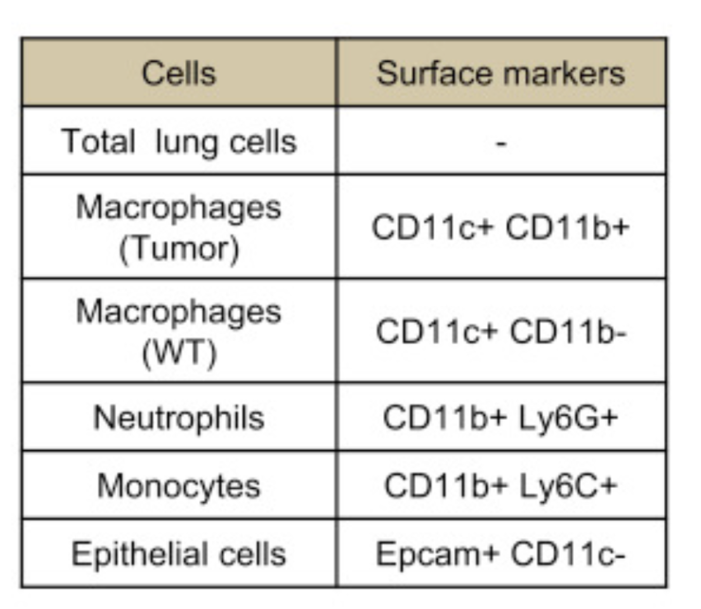

# 演習B：手順3

## 概要

- ここでは `tumor_communication.ipynb` を実行します

###  `tumor_communication.ipynb`  の内容は？


- 「非小細胞肺癌 (non-small-cell lung cancer; NSCLC)において、腫瘍組織内に存在する間質細胞から腫瘍細胞にシグナルのクロストークが起こって腫瘍が活性化されるか？ 」を調べてみる解析をRで行うノートブック
  - `.ipynb` というのがノートブックの拡張子です

### データの元論文

- Toi et al., Transcriptome Analysis of Individual Stromal Cell Populations Identifies Stroma-Tumor Crosstalk in Mouse Lung Cancer Model, Cell Reports (2015)
- https://doi.org/10.1016/j.celrep.2015.01.040


### サンプル・計測技術について

- 腫瘍モデルマウス由来のRNA-seqデータ
- ５種類の組織・細胞群 x 2種類の条件：
  - ５種類の組織・細胞群細胞群：
    - NSCLCモデルマウスと野生型のマウスの肺からセルソーターで分けたもの：マクロファージ、単球細胞、好中球、上皮細胞
      - 細胞型の分類は細胞表面の抗原マーカーによる
        - 
    - Total lung cells
  - 2種類の条件: WT （野生型; Wild type)、Tum (腫瘍; Tumor)

### 解析の方針

- 間質細胞において「正常組織由来のサンプル」に比べて「腫瘍組織由来のサンプル」で発現量が増加している遺伝子群を抽出する
- 腫瘍組織において正常組織において発現量が増加している遺伝子群を抽出する
- 「1.に含まれるリガンド」と「2.に含まれる受容体（レセプター）」をリガンド・受容体のペアのデータベースと比較する

### 実行方法

まず、Jupyter Hub のターミナルで以下のコマンドを実行してください。

```bash
wget https://www.dropbox.com/s/47qm8i5na8rket0/tumor_communication.ipynb
```

次に、Juputer Hub で `tumor_communication.ipynb` を開く。

### 使うデータの構造

- `gene_exp.diff`
  - マクロファージにおいて、各遺伝子の発現にWTとTumの条件間で差があるかを調べる発現変動解析の結果
  - 列の説明
    - test_id: 略
    - gene_id: 遺伝子ID（ここでは遺伝子名が用いられている）
    - gene: 略
    - locus: 略
    - sample_1: 略
    - sample_2: 略
    - status: 略
    - value_1: 正常組織でのマクロファージにおける遺伝子発現量の平均値
    - value_2: 腫瘍組織内マクロファージ (intratumoral macropahges)での遺伝子発現量の平均値
    - log2(fold_change): value_2/value_1をlog2変換したもの。正の値であれば value_2 > value_1、負の値であれば value_1 > value_2
    - test_stat: 略
    - p_value: 発現変動を判定する統計検定の結果のp-value。小さい方が統計的に有意。
    - q_value: p_value を多重検定補正したもの。小さい方が統計的に有意。
    - significant: 略

> ※ 縦に遺伝子名のようなものが並んでいる。各行が遺伝子、各列が変数になっている
p_valueやq_valueは発現変動を判定する統計検定の結果だろう
log2(fold_change) は value_2/value_1をlog2変換したものだろう
ちなみに、value_1 は正常組織でのマクロファージ、 value_2 は腫瘍組織内マクロファージ (intratumoral macropahges)でのFPKMの平均値
これは メタデータ をみないとわからない

- `HOM_MouseHumanSequence.rpt`
  - ヒト-マウスのオーソログ関係の表。生物種ごとの遺伝子について記述されている。
  - 列の説明
    - HomoloGene ID: オーソログ関係自体のID。これが互いに共通なヒト遺伝子・マウス遺伝子はオーソログ関係にある
    - Common Organism Name: 生物種名
    - NCBI Taxon ID: 略
    - Symbol: 遺伝子シンボル
    - EntrezGene ID
    - Mouse MGI ID: 略
    - HGNC ID: 略
    - OMIM Gene ID: 略
    - Genetic Location: 略
    - Genomic Coordinates (mouse: GRCm38, human: GRCh37.p10): 略
    - Nucleotide RefSeq IDs: 略
    - Protein RefSeq IDs: 略
    - SWISS_PROT IDs: 略

- `genes.read_group_tracking`
  - 腫瘍細胞において各遺伝子の発現量をまとめた表
  - 列の説明
    - tracking_id: 遺伝子のID
    - condition: 略
    - replicate: 略
    - raw_frags: 略
    - internal_scaled_frags: 略
    - external_scaled_frags: 略
    - FPKM: 正規化された遺伝子発現量。大きい方が遺伝子発現量（mRNA量）が多い。
    - effective_length: 略
    - status: 略

- `LR_manual_revised.txt`
  - ヒトにおける、リガンドと受容体のペアの対応関係をまとめた表
  - 列の説明
    - From: リガンドの遺伝子シンボル
    - To: 受容体の遺伝子シンボル  


- `GSE59831_processed_data_FPKM.txt`
  - 各サンプルでの各遺伝子の発現量を調べた表
    - Tum1, Tum2, Tum3 が腫瘍組織内マクロファージ、WT1, WT2が野生型組織でのマクロファージ、Tum9, Tum10, Tum11が腫瘍細胞における遺伝子発現量
  - 列の説明
    - mice_gene_symbol: マウスのおける遺伝子シンボル
    - human_gene_symbol: ヒトのおける遺伝子シンボル
    - Tum1
    - Tum2
    - Tum3
    - WT1
    - WT2
    - Tum4
    - Tum5
    - WT3
    - WT4
    - Tum6
    - Tum7
    - Tum8
    - WT5
    - WT6
    - WT7
    - Tum9
    - Tum10
    - Tum11
    - WT8
    - WT9
    - WT10
    - Tum12
    - Tum13
    - Tum14
    - WT11
    - WT12
    - WT13
