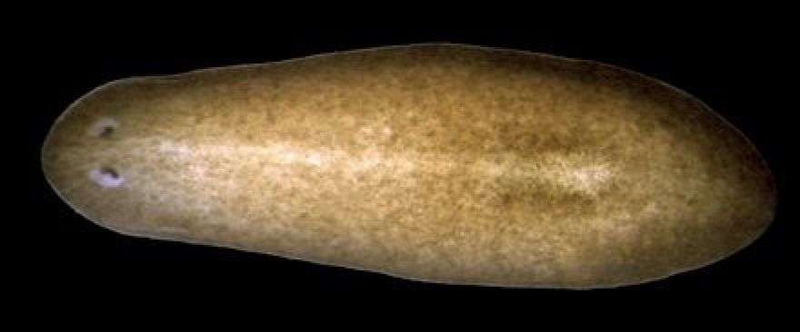

# 演習C：イントロ

## １細胞RNA-seqについて

{% pdf src="slide.pdf", width="100%", height="450" %}

## 演習Cでは、何をやるの？

- プラナリアの１細胞RNA-seqデータを解析します

### プラナリア？

- 切っても再生する生き物
- https://en.wikipedia.org/wiki/Schmidtea_mediterranea

### どんなデータ？

- 元論文
  - Comparative transcriptomic analyses and single-cell RNA sequencing of the freshwater planarian Schmidtea mediterranea identify major cell types and pathway conservation https://genomebiology.biomedcentral.com/articles/10.1186/s13059-018-1498-x
  - freshwater planarian *Schmidtea mediterranea*
  - Drop-seq
- プラナリアの scRNA-seq データ解析
  - https://www.ncbi.nlm.nih.gov/geo/query/acc.cgi?acc=GSE115280
  - cluster markers https://figshare.com/articles/Additional_file_4/6852896
  - https://genomebiology.biomedcentral.com/articles/10.1186/s13059-018-1498-x

## １細胞RNA-seq解析の基本的な流れ

{% pdf src="slide2.pdf", width="100%", height="450" %}

今回は１細胞RNA-seq解析でよく使われる [Seurat （すーら）](https://satijalab.org/seurat/) というパッケージを使用します。

Drop-seqという１細胞RNA-seqの場合、どの細胞がどんな細胞型かがわからない。そこで、個々の細胞がどんな細胞かを「遺伝子発現のみから」明らかにする必要がある。この作業を細胞型アノテーション（Cell type annotation）と呼びます。

1. 遺伝子発現のカウント行列を読み込む
  - 行が遺伝子数 x 列が細胞、各要素がある遺伝子のある細胞でのリードカウントになっている
2. 品質の低い細胞をフィルターする
  - 実験手法の制約から全ての細胞が良い品質のデータに変換されているわけではない
  - ここでは、 `nFeature_RNA` （ある細胞で検出された遺伝子の数）、 `nCount_RNA` (ある細胞のリードカウントの合計) が低い細胞を除く（高い細胞だけを選ぶ）
3. 発現量データを正規化する
  - 細胞ごとにリードカウントの合計値が違う場合、元のカウントを細胞間で比較しても意味がない
    - 遺伝子発現量は「割合」に近いイメージ
  - そこで、細胞間で遺伝子発現量を比較できるように、カウントデータを正規化する
4. 高変動遺伝子（highly variabe genes) を抽出する
  - 全ての遺伝子の発現量が重要なわけではない
  - 「個々の細胞の細胞型の違い・多様性」を見分けるためには、「細胞間で発現量が異なる遺伝子」を見なければならない
  - そこで「細胞間で発現量が大きく変動している遺伝子」を抽出する
    - この際、遺伝子によっては「ノイズ」のように変動するものもあるため、統計学的に有意に高い変動を示す遺伝子を抽出することが重要
5. 発現量データをスケーリングする
  - 細胞のアノテーションの前段階として、細胞のクラスタリングを行いたい
    - 計算処理の高速化や計測ノイズをならす意味がある
  - 細胞のクラスタリングには、遺伝子たちを変数として使用する
  - この際、このままでクラスタリングすると、発現量が大きい遺伝子の影響が大きくなる
  - そのため、遺伝子間での発現量のスケールを揃える（スケーリング）ことが必要となる
6. PCA（主成分分析）を用いて次元削減を行う
  - クラスタリングの前に次元圧縮をすることで、データの多様性をなるべく損ねずに効率的にクラスタリングができる
  - PCAはデータの多様性をなるべく損ねずに次元圧縮できる
7. 細胞をクラスタリングする
8. 各クラスターに特徴的な遺伝子群を探す
9. 各クラスターがどんな細胞型かを類推する
  - 遺伝子機能の知識が不足している場合は、オーソログの情報を使うと良い
